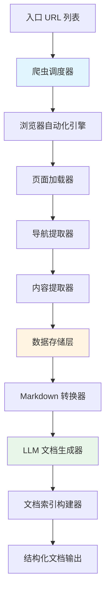
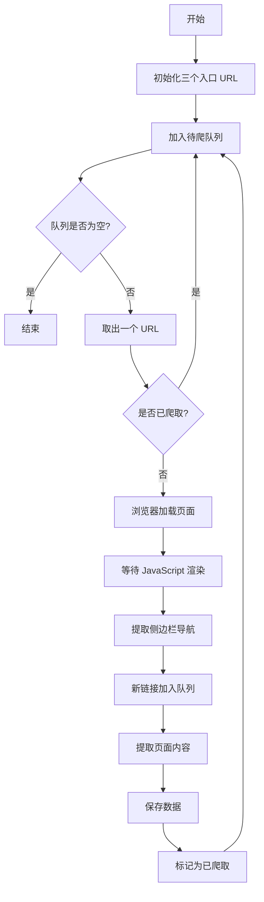
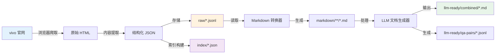

# vivo 手表文档爬虫与 LLM 文档生成系统设计

## 一、项目背景与目标

### 1.1 项目背景
vivo BlueOS 手表开发文档不在主流大模型的训练数据中，导致 AI 辅助开发时无法提供准确的 API 使用建议和代码示例。官方文档采用 JavaScript 动态渲染，需要专门的爬取方案。

### 1.2 项目目标
- **阶段一**：实现智能爬虫，抓取官方文档的所有内容
- **阶段二**：将爬取的数据转换为适合 LLM 的 Markdown 文档格式
- **未来扩展**：为 MCP 服务提供结构化的文档数据基础

### 1.3 核心价值
- 获取完整的 vivo 手表开发文档知识库
- 为 AI 辅助开发提供准确的上下文信息
- 支持离线文档查询和示例检索

## 二、技术挑战分析

### 2.1 网站特性
- **动态渲染**：页面内容完全依赖 JavaScript 生成，传统 HTTP 请求无法获取内容
- **导航结构**：侧边栏菜单包含多级分类，需要完整遍历
- **内容分类**：文档分为三大类（快速开始/教程、JS API、UI 组件）

### 2.2 爬取难点

| 难点 | 描述 | 解决方向 |
|------|------|----------|
| JavaScript 渲染 | 内容动态加载，静态爬虫无法获取 | 使用浏览器自动化工具 |
| 导航发现 | 侧边栏菜单结构需要解析 | 提取导航 DOM 结构并遍历 |
| 内容提取 | 需要识别正文区域，过滤无关元素 | 定位主内容区域选择器 |
| 去重与完整性 | 避免重复爬取，确保不遗漏页面 | URL 去重机制和爬取状态跟踪 |

## 三、系统架构设计

### 3.1 整体架构



### 3.2 核心组件职责

#### 3.2.1 爬虫调度器
- **职责**：协调整个爬取流程，管理待爬取 URL 队列
- **核心功能**：
  - 维护待爬取 URL 队列（先进先出）
  - URL 去重验证
  - 爬取进度追踪
  - 失败重试机制
  - 并发控制（避免过载）

#### 3.2.2 浏览器自动化引擎
- **职责**：模拟真实浏览器环境，执行 JavaScript 渲染页面
- **核心功能**：
  - 启动和管理无头浏览器实例
  - 页面导航和等待渲染完成
  - 处理页面加载超时
  - 资源优化（禁用图片、视频等非必要资源）

#### 3.2.3 导航提取器
- **职责**：从侧边栏解析文档结构和所有链接
- **核心功能**：
  - 定位侧边栏导航容器
  - 提取多级菜单结构（分类名称、子分类、页面链接）
  - 解析相对 URL 为绝对 URL
  - 记录文档层级关系

#### 3.2.4 内容提取器
- **职责**：从页面中精准提取文档正文
- **核心功能**：
  - 定位主内容区域
  - 提取标题层级结构
  - 提取正文段落、代码示例、表格
  - 过滤导航栏、页脚等无关内容
  - 保留代码块的语言标记

#### 3.2.5 数据存储层
- **职责**：持久化原始爬取数据
- **数据结构**：

| 字段 | 类型 | 说明 |
|------|------|------|
| url | 字符串 | 页面完整 URL |
| title | 字符串 | 页面标题 |
| category | 字符串 | 所属分类（教程/JS API/UI 组件） |
| sub_category | 字符串 | 子分类名称 |
| breadcrumb | 列表 | 面包屑路径 |
| content_html | 字符串 | 原始 HTML 内容 |
| content_text | 字符串 | 纯文本内容 |
| code_examples | 列表 | 代码示例集合 |
| crawl_time | 时间戳 | 爬取时间 |
| status | 字符串 | 爬取状态（成功/失败） |

#### 3.2.6 Markdown 转换器
- **职责**：将 HTML 内容转换为格式良好的 Markdown
- **核心功能**：
  - HTML 标签到 Markdown 语法映射
  - 代码块格式化（保留语言标记）
  - 表格转换
  - 列表层级处理
  - 链接转换（保留内部引用）

#### 3.2.7 LLM 文档生成器
- **职责**：生成适合大模型理解的文档格式
- **核心功能**：
  - 为每个文档添加元数据头部
  - 生成文档摘要和关键词
  - 代码示例规范化处理
  - 上下文关联信息补充
  - 生成问答对（Question-Answer pairs）

#### 3.2.8 文档索引构建器
- **职责**：为 MCP 服务准备结构化索引
- **核心功能**：
  - 构建文档层级索引
  - API 参数索引
  - 代码示例索引
  - 关键词倒排索引
  - 生成文档元数据清单

## 四、阶段一：智能爬虫设计

### 4.1 爬取策略

#### 4.1.1 爬取流程



#### 4.1.2 导航提取策略

**侧边栏结构识别**：
- 定位包含导航菜单的 DOM 容器
- 识别分类标题（如"通用"、"基础组件"）
- 提取每个分类下的链接列表
- 记录层级关系（一级分类 → 二级分类 → 具体页面）

**URL 收集规则**：
- 仅爬取 `developers.vivo.com/product/blueos/doc/` 路径下的页面
- 过滤外部链接和锚点链接
- 保留查询参数（如果影响内容）
- 统一 URL 格式（去除末尾斜杠）

#### 4.1.3 内容提取策略

**主内容定位**：
- 通过 CSS 选择器定位主文档区域
- 识别标题标签（h1-h6）建立文档大纲
- 提取段落、列表、表格
- 特别标记代码块及其语言类型

**代码示例提取**：
- 识别代码块容器
- 提取语言标记（JavaScript、CSS、JSON 等）
- 保留代码缩进和格式
- 提取代码说明和注释

### 4.2 数据存储设计

#### 4.2.1 存储格式
采用 JSON Lines 格式存储原始数据，每行一条记录，便于流式处理。

#### 4.2.2 文件组织结构

```
data/
├── raw/                          # 原始爬取数据
│   ├── tutorial.jsonl           # 教程文档
│   ├── js-api.jsonl             # JS API 文档
│   └── ui-component.jsonl       # UI 组件文档
├── navigation/                   # 导航结构
│   └── site-structure.json      # 完整站点结构
└── metadata/                     # 元数据
    ├── crawl-log.jsonl          # 爬取日志
    └── statistics.json          # 统计信息
```

### 4.3 异常处理与容错

#### 4.3.1 异常场景处理

| 异常场景 | 处理策略 |
|----------|----------|
| 页面加载超时 | 记录失败，加入重试队列（最多 3 次） |
| 导航结构变化 | 使用备用选择器，记录警告日志 |
| 内容提取失败 | 保存原始 HTML，标记待人工审查 |
| 网络中断 | 保存当前进度，支持断点续爬 |
| 反爬虫限制 | 添加随机延迟，模拟用户行为 |

#### 4.3.2 质量保证机制
- 验证每个页面是否成功提取到内容
- 检查代码示例是否完整
- 统计爬取覆盖率（已爬/总链接数）
- 生成爬取报告（成功/失败/跳过）

## 五、阶段二：LLM 文档生成设计

### 5.1 文档转换流程


### 5.2 Markdown 文档结构

#### 5.2.1 文档模板结构

每个页面生成独立的 Markdown 文件，结构如下：

**文档头部元数据区**：
- 文档标题
- 所属分类和路径
- 原始 URL
- 最后更新时间
- 关键词标签

**正文内容区**：
- 保持原文档的标题层级
- 段落内容
- 代码示例（带语言标记）
- 表格和列表
- 内部链接转换为相对引用

**示例增强区**：
- 提取的所有代码示例汇总
- 每个示例添加使用场景说明
- 关联的 API 参数说明

#### 5.2.2 代码示例规范化

**代码块标准格式**：
- 明确标记语言类型（javascript、css、json 等）
- 添加示例标题或用途说明
- 保留完整的上下文信息
- 标注关键 API 调用

**示例分类**：
- 完整示例：可直接运行的完整代码
- 片段示例：展示特定 API 用法的代码片段
- 配置示例：配置文件或参数设置

### 5.3 LLM 优化处理

#### 5.3.1 上下文增强策略

为每个文档补充以下上下文信息：
- **相关 API 列表**：提取文档中涉及的所有 API 方法
- **依赖关系**：标注需要配合使用的其他组件或 API
- **使用场景**：总结该功能的典型应用场景
- **常见问题**：提取注意事项和限制说明

#### 5.3.2 问答对生成

基于文档内容生成结构化问答对，辅助 LLM 理解：

**问题类型**：
- 概念理解型：这个 API/组件的作用是什么？
- 用法查询型：如何使用某个功能？
- 参数说明型：某个参数的含义和取值范围？
- 示例参考型：某个场景的代码示例是什么？

**问答格式**：
- 问题：明确具体的开发问题
- 答案：结合文档内容和代码示例的完整回答
- 代码：相关的代码示例（如果适用）

### 5.4 文档输出组织

#### 5.4.1 输出目录结构

```
output/
├── markdown/                        # Markdown 文档
│   ├── tutorial/                   # 教程文档
│   │   ├── quickstart/            # 快速开始
│   │   ├── basic-guide/           # 基础指南
│   │   └── advanced-guide/        # 进阶指南
│   ├── js-api/                     # JS API 文档
│   │   ├── system/                # 系统 API
│   │   └── ...                    # 其他 API 分类
│   └── ui-component/               # UI 组件文档
│       ├── common/                # 通用组件
│       ├── basic/                 # 基础组件
│       ├── form/                  # 表单组件
│       └── ...                    # 其他组件分类
├── llm-ready/                       # LLM 就绪文档
│   ├── combined/                   # 合并文档（按类别）
│   │   ├── tutorial-complete.md   # 完整教程文档
│   │   ├── js-api-complete.md     # 完整 API 文档
│   │   └── ui-component-complete.md # 完整组件文档
│   └── qa-pairs/                   # 问答对数据
│       └── qa-dataset.jsonl       # 问答数据集
└── index/                           # 索引文件（为 MCP 准备）
    ├── doc-index.json              # 文档索引
    ├── api-index.json              # API 索引
    ├── component-index.json        # 组件索引
    └── code-examples-index.json    # 代码示例索引
```

#### 5.4.2 索引文件结构（MCP 前置工作）

**文档索引**：
- 文档 ID 到文件路径的映射
- 文档标题和摘要
- 分类和标签
- 文档间的引用关系

**API 索引**：
- API 名称和命名空间
- 参数列表和类型信息
- 返回值说明
- 使用示例位置引用

**组件索引**：
- 组件名称和类型
- 属性列表
- 事件列表
- 使用示例位置引用

**代码示例索引**：
- 示例唯一标识
- 示例类型和用途
- 涉及的 API/组件
- 源文档引用

### 5.5 合并文档策略

#### 5.5.1 分类合并规则

将同类文档合并为单个大文档，便于 LLM 整体理解：
- 按文档层级顺序合并
- 保留完整的标题层级（自动调整级别避免冲突）
- 在合并点添加分隔标记和导航锚点
- 保持代码示例的完整性

#### 5.5.2 文档大小控制

如果合并后文档过大（超过 100000 字）：
- 按一级分类拆分为多个文档
- 生成目录文档，提供各部分的概述和链接
- 在每个拆分文档中添加相关文档的引用链接

## 六、数据流转设计

### 6.1 完整数据流



### 6.2 数据质量验证

在各个阶段添加验证点：

| 阶段 | 验证内容 | 验证标准 |
|------|----------|----------|
| 爬取完成 | 页面完整性 | 每个页面都有标题和正文内容 |
| 内容提取 | 代码示例 | 代码块格式完整，有语言标记 |
| Markdown 转换 | 格式正确性 | Markdown 语法无错误，链接有效 |
| LLM 文档生成 | 元数据完整性 | 每个文档都有必要的元数据 |
| 索引构建 | 引用一致性 | 索引中的文件路径都存在 |

## 七、实现优先级与里程碑

### 7.1 开发阶段划分

**阶段 1.1：基础爬虫（核心功能）**
- 浏览器自动化引擎初始化
- 单个页面加载和内容提取
- 基本的数据存储

**阶段 1.2：导航遍历（完整性保证）**
- 侧边栏导航解析
- URL 队列管理和去重
- 全站遍历爬取

**阶段 1.3：异常处理与优化（稳定性提升）**
- 重试机制
- 断点续爬
- 性能优化（并发控制、资源过滤）

**阶段 2.1：基础转换（格式转换）**
- HTML 到 Markdown 转换
- 基本文件组织结构
- 代码示例提取和规范化

**阶段 2.2：LLM 优化（智能增强）**
- 元数据注入
- 上下文增强
- 问答对生成

**阶段 2.3：索引构建（MCP 准备）**
- 文档索引生成
- API 和组件索引
- 代码示例索引

### 7.2 验收标准

**阶段一验收标准**：
- 成功爬取三大入口的所有侧边栏链接页面
- 爬取成功率 > 95%
- 每个页面都提取到标题、正文、代码示例
- 生成完整的爬取日志和统计报告

**阶段二验收标准**：
- 所有页面都转换为格式正确的 Markdown
- 代码示例保持完整且带语言标记
- 生成合并后的 LLM 就绪文档
- 生成完整的索引文件（JSON 格式）
- 问答对数据集包含至少 100 条有效问答

## 八、技术选型建议

### 8.1 浏览器自动化工具选择

| 工具 | 优势 | 适用场景 |
|------|------|----------|
| Playwright | 现代化、速度快、API 简洁 | 推荐首选 |
| Selenium | 生态成熟、文档丰富 | 需要更多浏览器兼容性 |
| Puppeteer | 轻量、Node.js 原生 | 熟悉 Node.js 生态 |

### 8.2 HTML 解析工具

| 工具 | 优势 | 适用场景 |
|------|------|----------|
| BeautifulSoup | 易用、容错性强 | Python 生态推荐 |
| lxml | 性能高、支持 XPath | 需要高性能解析 |
| Cheerio | 类 jQuery API | Node.js 生态 |

### 8.3 Markdown 转换工具

| 工具 | 优势 | 适用场景 |
|------|------|----------|
| html2text | 简单直接 | 基础转换需求 |
| Pandoc | 功能强大、格式丰富 | 复杂文档转换 |
| Turndown | JavaScript 生态成熟 | Node.js 项目 |

## 九、风险评估与应对

### 9.1 潜在风险

| 风险类型 | 风险描述 | 影响程度 | 应对策略 |
|----------|----------|----------|----------|
| 网站结构变化 | vivo 官网改版导致选择器失效 | 高 | 使用语义化选择器，准备备用方案 |
| 反爬虫机制 | 触发频率限制或 IP 封禁 | 中 | 添加延迟，使用代理池 |
| 内容动态加载 | 部分内容延迟加载或异步获取 | 中 | 智能等待机制，滚动加载触发 |
| 文档规模超预期 | 页面数量远超预估 | 低 | 增量爬取，分批处理 |

### 9.2 质量风险控制

- 定期验证爬取的文档样本质量
- 对比原网页与生成的 Markdown 确保信息无丢失
- 代码示例可执行性检查（如果可能）
- 建立文档版本管理，支持增量更新

## 十、后续 MCP 服务设计方向

### 10.1 MCP 服务能力规划

基于本设计生成的索引和文档，未来 MCP 服务将提供：

**核心能力**：
- 根据开发意图搜索相关 API 和组件
- 提供完整的代码示例和参数说明
- 上下文感知的 API 推荐
- 生成符合 vivo 规范的代码片段

**数据依赖**：
- 使用本阶段生成的文档索引进行快速检索
- 基于问答对数据训练或检索
- 利用代码示例索引提供精准示例匹配

### 10.2 MCP 前置工作检查清单

本设计已完成的 MCP 准备工作：
- ✓ 结构化的文档索引（doc-index.json）
- ✓ API 参数和方法索引（api-index.json）
- ✓ 组件属性和事件索引（component-index.json）
- ✓ 代码示例索引（code-examples-index.json）
- ✓ 问答对数据集（qa-dataset.jsonl）
- ✓ 清晰的文档层级和分类

未来 MCP 实现时的待开发部分：
- 语义搜索引擎集成
- 向量化嵌入生成
- 实时查询接口
- 代码生成模板引擎- 实时查询接口
